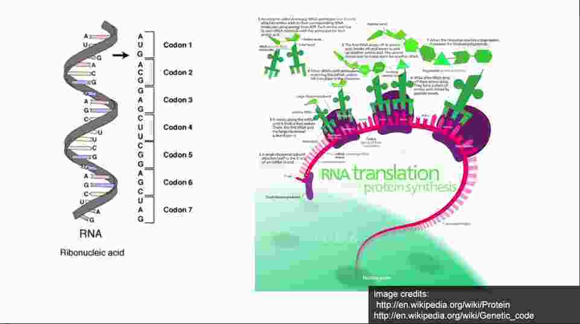

## Important cell is biology

1. DNA comprise of 4 nucleotides
  * Adenine
  * Guanine
  * Cytosine
  * Thymine

  

  * Dna strucutre is similar, these nucleotides bind together in specific fashion. A(Adenine) always binds with T(Thymine) and G(Guanine) always binds with (T)Thymine.

  
dna_famous_structure
  * DNA strucutre as we know.

  

  * Above strucutre is in from of long ladders, ladders are twisted in on helix, all our cells have dna in these structure.

  * DNA in our genome is organised in 23 chromosomes pair, and these chromosomes are very very long string, consist of 250 million of such nucleotides, very tightly coiled up and packed inside nucleas of every cell inside our body

  * Writing DNA, we write DNA using the four character.
    * DNA has the direction we call it **strandedness**
    *
    Here I got confused...Some 5 prime 3 and 3 prime 5,

  

#### RNA
  * These are similar to RNA, but unlike other nucleotides, we've T(Thymine) replaced by U(Uracil), they are single stranded, they can form double stranded complexes but in general they're single stranded.

  

  * From RNA template we create proteins.
   

   * We write RNA same as DNA but all T's(Thymine) are replaced with U's(Uracil) ( Same 5 prime 3 (which i don't understand))

 > **Important point to note is we inherit DNA not RNA, DNA is what we get when cell divide, although RNA is similar to DNA but we inherit DNA**

  * RNA to protein translation by some encoding done in late 1960
    

    * Every three letter of RNA is turned into Amino acid, there are 64 such possible codons, out of which 61 is encoded to protein.
    * Long strands of amino acid are called protein, so three of nuclotides form amino acid and these long strands of amino acid strung together to form protein.

    * There are 20 amino acid that comprise our protein, probably these are the only amino-acid can be formed.
