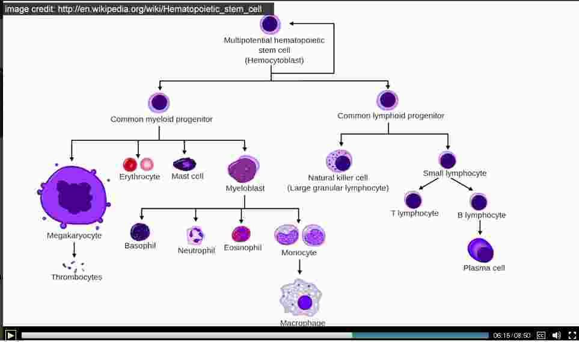
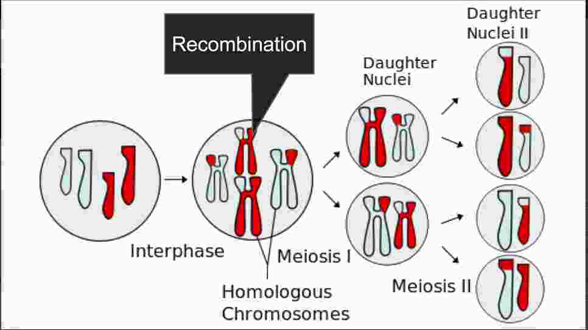

## Cell biology and molecular biology

* Cellular organisms are divided into 3 domain.
  * Prokarytos   ---They don't have cell nuclei
    1. Bacteria
    2. Archaea
  * Eukaryotes  --- They've cell nuclei
    1. Eukaryota

* Our cells contains nucleus , inside that we've chromosomes and inside
those chromosomes our DNAs reside.

* In Eukaryotes, we've mitocondria, and they've their own dna's they've quite small,
they've called powerhouse of cell, because they're reponsible for energy metabiolism.

##### Cell Division
  *  Mitosis and miosis as I remember them
    * ##### In mitosis
      We've anaphase and meta-phase and similar cell division
      > One thing to understand is initially  DNA is cell has to replicate
      It has to make two copies where there was one copy before
      **Inside the cell before divide there were two copies**, after replicate we've
      four copies, and now cell figures how to divide.

    * While it divides it maintains two exact copies of same chromosomes,
    * Important aspect is not always cell divide into identical copies
    * We'll start with a single stem-cell , that've capablity to divide and differentiate into multiple cells.

    
    * So all cells come from stem-cell and their population is maintained over time

  * ##### In miosis

    * Actually in miosis, we've something called recombination.
    * The chromosomes are so similar that they combine with each other, so chromosomes from mom and dad combine and hence we've chromosomes, which has not identical to mom and dad but something different, which partly 'mom' and partly 'dad'

    

    *     * This recombination is big source of diversity in our population.
